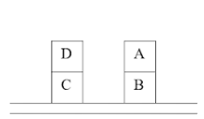
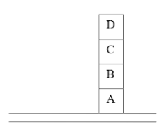

# Blocks World with A* Algorithm

## Description

This repository contains the implementation of the blocks world problem using the A* algorithm to find the optimal sequence of moves that leads an initial configuration of blocks to a desired final configuration.

## Problem

In the blocks world problem, blocks are initially stacked on a table. A free block can be moved onto the table or onto another free block. The objective is to find the sequence of moves that leads from the initial configuration to the desired final configuration, minimizing the total cost of the moves.

### Initial State



### Final State


### Movement Costs
- Block A: 1
- Block B: 2
- Block C: 2
- Block D: 3

## A* Algorithm

The A* algorithm is a search algorithm that uses the cost function f(n) = g(n) + h(n), where:
- g(n) is the cost of the path from the initial state to state n.
- h(n) is a heuristic that estimates the cost from state n to the final state.

### Heuristic Used
The heuristic used in this problem is the number of blocks out of their desired position.

## Repository Structure

- `README.md`: This file with the project description.
- `aStar.py`: Implementation of the block world problem using the A* algorithm.
- `format.py`: Script that shows visually the path followed by the algorithm.
- `main.py`: Contains the example of the initial e final state presented previously to test run the code.

## How to Use

### Steps

1. Clone the repository:
    ```sh
    git clone https://github.com/maduMelo/Blocks-World-A-Star.git
    cd block-world-a-star
    ```

2. Run the `main.py` script:
    ```sh
    python main.py
    ```

3. To modify the initial and final states, you must manually alter the code on the `main.py` file. The syntax used is a Python dictionary where the key is the block to which we want information and the value is a tuple that holds on the first position the block that is on top of the block we want information (False if there is no block over it) and the second position, the block that is below it ("M" represents the table). P.s.: In order for it to work the value for the "M" key must never be altered.

## Usage Example

### Input
```sh
initial_state = { "A": (False, "B"), "B": ("A", "M"), "C": ("D", "M"), "D": (False, "C"), "M": (False,) }
final_state = { "A": ("B", "M"), "B": ("C", "A"), "C": ("D", "B"), "D": (False, "C"), "M": (False,) }

block_costs = {"A": 1, "B": 2, "C": 2, "D": 3}
```

### Output
```
Estado Inicial

A D
B C
------

  ↓

    D
A B C
------

  ↓

B D
A C
------

  ↓

B    
A C D
------

  ↓

C
B  
A D
------

  ↓

Estado Final

D
C
B
A
------
```

P.s.: Although the algorithm works for as many blocks as you wish, as long as you follow the indicated syntax to organise the information, the format function to display the steps followed by the algorithm only works with four blocks, so the intermediate output you get is on the variable path that holds the information of the current state and the state before that one, so you are able to backtrack the steps until the initial state.

## License
This project is licensed under the MIT License - see the `LICENSE` file for details. 